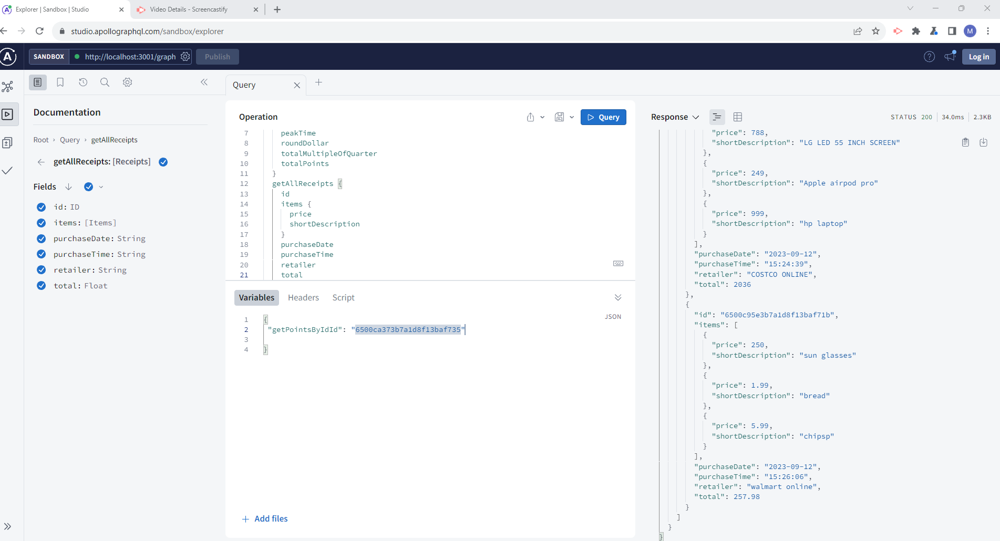
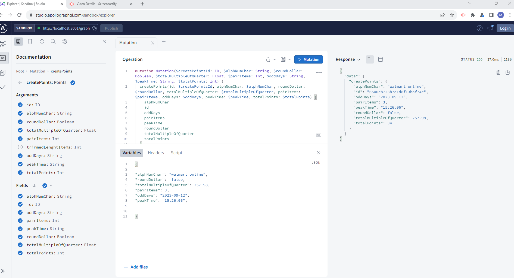

# receipt-processor

## Description
Receipts and Points processor is a backend application that processes recipts and calculate points based on 6 rules of calculations and store the data in the database.manager can get the receipt by id, and can get all the receipts, and can add points based on receipt, and can get points by id

## used Technologies
- JavaScript, Node.js, Express.js, MongoDB, Mongoose, GraphQl, Apolloserver, apollor-server-xpress, date-format, Github,VScode,GoogleChromeDev,NPM, 

## Instructions
- Clone the repo `https://github.com/melhelow/receipt-processor.git`
- Run `npm install` to install all dependencies.
- ` npm init -y` .
- ` npm i express mongoose apollo-server-express graphql date-format @apollo/server`.
- Run `npm start` to start the local server
- when this message appear in your terminal :
`🌍 Now listening on localhost:3001
Use GraphQL at http://localhost:3001/graphql`.
- press on the link `http://localhost:3001/graphql` .
- press on Query your server on the graphQl sandbox, because your your server is runing you can use the following queries and mutations to get the data from the database

## video Demo
- please check this screencastify Demo for your refernce
- https://drive.google.com/file/d/1WfG2EPlgKc8A_HGDxOFmBQ2n6x-I_Qbf/view

## Experinced Challanges
- I faced some challenges in the beginning to understand the requirements, but after I read the requirements carefully and understand the rules of calculations, I was able to start the project and finish it on time.
- 48 hrs delivery window, I was able to finish the project on time, but I think if I had more time I would have done more testing and more validations.

## Future Development
- I would like to add more validations and more testing to the project.
- better psuedocode.
- I would like to add more features to the project like adding more rules of calculations and more features to the manager to be able to add more points to the customer.
- referance the Points Model to the  Receipt Model.
- get Total points for all customers.
- get Total points for each customer inside the purchase receipt.

## screenshots

## License
- MIT License

